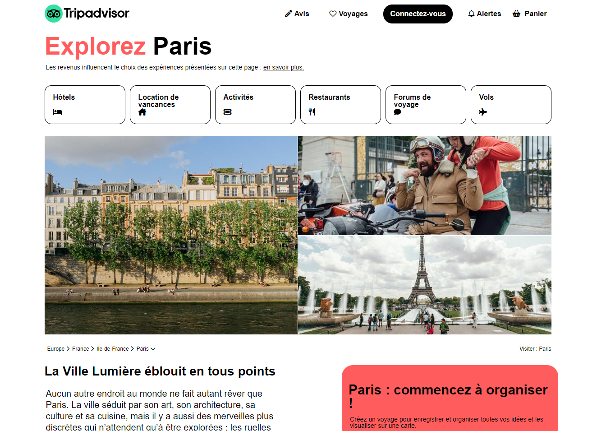

# tripAdvisor

## Description

Ce projet est un clone du site TripAdvisor. Il a été réalisé dans le cadre de ma formation au Réacteur. Ce projet a été developpé avec HTML et CSS.
Il est entièrement responsive.

Le projet est hebergé sur Netlify, vous pouvez y accéder en suivant ce [lien](https://hmtripadvisor.netlify.app/).
